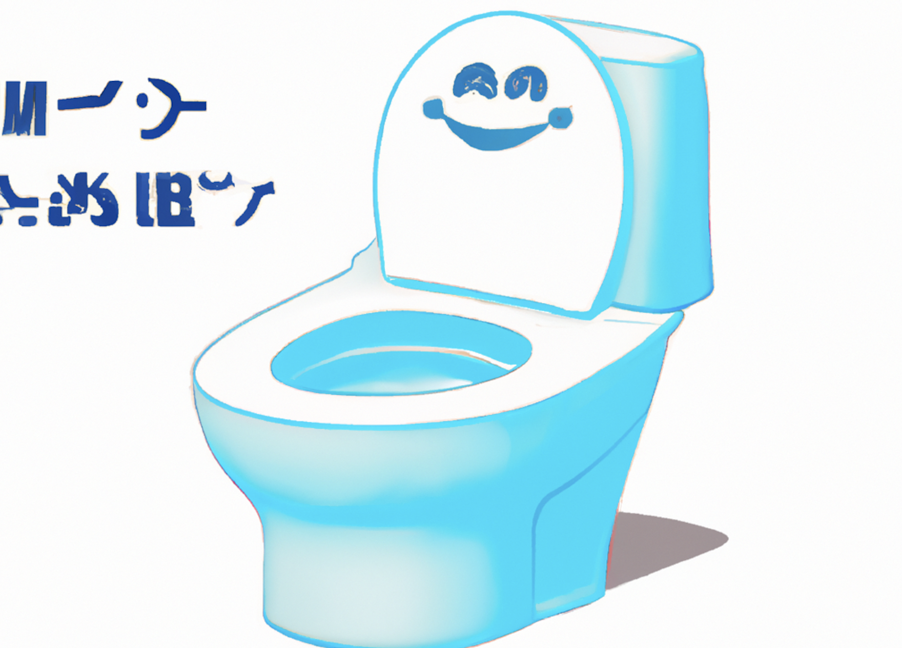

<link rel="stylesheet" href="style.css">

<!-- Begin Mailchimp Signup Form -->

    <form action="https://happydaybidet.us14.list-manage.com/subscribe/post?u=05771dc86b596ebb433b9f6d4&amp;id=a6b5fa97e3&amp;f_id=0022bde0f0" method="post" id="mc-embedded-subscribe-form" name="mc-embedded-subscribe-form" class="validate" target="_self">
        

        <h2>Please email me when Happy Day Bidet! is available!</h2>
        
* indicates required

	<label for="mce-EMAIL">Email Address  *
</label>
	<input type="email" value="" name="EMAIL" class="required email" id="mce-EMAIL" required>
	

	

		

		

	
    <!-- real people should not fill this in and expect good things - do not remove this or risk form bot signups-->
    
<input type="text" name="b_05771dc86b596ebb433b9f6d4_a6b5fa97e3" tabindex="-1" value="">

        

            

                <input type="submit" value="Subscribe" name="subscribe" id="mc-embedded-subscribe" class="button">
                

            

        

    

</form>

<!--End mc_embed_signup-->